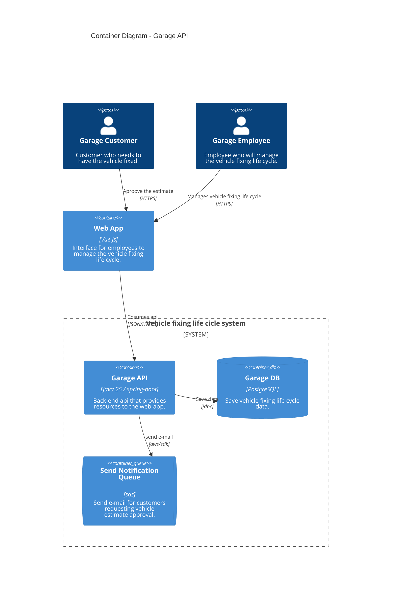

# Documento de entrega tech challenge (fase 1)

## Grupo

- Rodrigo de Sordi

## Integrantes

- Rodrigo de Sordi - RM372537 - rodsordi@gmail.com

## Repositório

- https://github.com/rodsordi/15SOAT-TechChallenge

## Vídeo

- https://youtu.be/o5ZKbYcL3jc

## Documentação

- https://github.com/rodsordi/15SOAT-TechChallenge/wiki

### Dicionário da Linguagem Ubíqua:

- **Customer:** Cliente que possuí veículo e precisa de serviços de mecânica.
- **Vehicle:** Veículo do cliente que é o item a ser analisado, revisado ou reparado.
- **Employee:** Funcionário da mecânica que atende o cliente ou realiza serviços de mecânica em veículos.
- **Service:** Serviços referentes a reparos de veículos ou manutenção preventiva.
- **Diagnostic:** Análise dos serviços relatados pelo cliente, a serem feitos no veículo.
- **Work Order:** Ordem de serviço que lista todo o ciclo de vida dos serviços solicitados pelo cliente.
- **Estimate:** Orçamento dos serviços listados na ordem de serviço.
- **Shop Supplies and Spare Parts:** Peças e insumos necessários para realização dos serviços solicitados.
- **Inventory:** Estoque de peças e insumos da mecânica.

### Domain Story Telling

- https://egon.io/app/
- https://github.com/rodsordi/15SOAT-TechChallenge/blob/dev/docs/domain-storytelling.egn

### Event Storming

- [Link de acesso ao Miro compartilhado para visualização](https://miro.com/welcomeonboard/L2JXRVI4dWtaS3hoNGdyYkNTVWh0KytocHpUOStGTkpmREpQK1Z6RlNmbm03R3dmNDZESnN4S2tkaFFEZTBHcFF0VWJtNk40aXV0eXZlNGVyNW9lZkpROUJDWGhNRDdaZ0pTS3l2bkpwVk1NeDBLS290RHF3dExpeWk0RktBamdBd044SHFHaVlWYWk0d3NxeHNmeG9BPT0hdjE=?share_link_id=975820106497)

### c4model

## Relatório de cobertura de testes de unidade

- Obs: Apesar de ter testes em várias camadas, restringi para validar apenas o módulo domain e ainda restringi mais alguns packages que entendi que não teriam impacto na cobertura.

## Relatório vulnerabilidades

- https://github.com/rodsordi/15SOAT-TechChallenge/blob/dev/docs/dependency-check-report.html
- Obs: Resolvi todas as vulnerabilidades de nível alto, estou fazendo uma conceção sobre 2 vulnerabilidades médias devido à falta de resolução até o momento do relatório.
