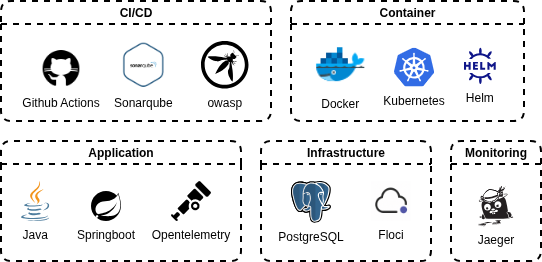

# IaC

## 🏗️ Infrastructure

This repository contains the Terraform configurations and automation scripts to provision and manage the infrastructure
required for the project, including Kubernetes (K8S) clusters, GitHub self-hosted runners, and security analysis tools.



## ⚙️ Setup

Before executing the Terraform scripts, you need to configure the required environment variables for authentication and
third-party integrations.

```sh
export TF_VAR_github_pat="your_github_pat_here"
export TF_VAR_sonar_admin_password="Sonarqube@2026"
```

### OWASP Setup

To perform security and vulnerability scans during the pipeline execution, it is highly recommended to use an NVD API
Key.

- Request an api-key on https://nvd.nist.gov/developers/request-an-api-key
- Note: This step is optional but strongly recommended as it prevents rate-limiting issues and ensures up-to-date
  vulnerability definitions.

```sh
export NVD_API_KEY="your_confirmed_api_key_from_email"
echo $NVD_API_KEY
```

## 💾 Terraform - Installation

**Linux**

```sh
wget -O - https://apt.releases.hashicorp.com/gpg | sudo gpg --dearmor -o /usr/share/keyrings/hashicorp-archive-keyring.gpg
```

```sh
echo "deb [arch=$(dpkg --print-architecture) signed-by=/usr/share/keyrings/hashicorp-archive-keyring.gpg] https://apt.releases.hashicorp.com $(grep -oP '(?<=UBUNTU_CODENAME=).*' /etc/os-release || lsb_release -cs) main" | sudo tee /etc/apt/sources.list.d/hashicorp.list
```

```sh
sudo apt update && sudo apt install terraform
```

**Windows**

- https://developer.hashicorp.com/terraform/install
- Extract in `C:\devtools\terraform`
- Add `C:\devtools\terraform` to Path

### ☸️ Terraform - K8S

Follow these commands to initialize, plan, and apply the infrastructure changes. These commands are compatible with
Linux and Windows (Git Bash) environments.

**Uninstall**

```sh
terraform init -upgrade
terraform destroy -auto-approve
```
```sh
kubectl delete namespace garage
```

**Kubernetes setup *(Linux/Windows Gitbash)***

After a successful deployment, source the helper script to export the Kubernetes configuration:

```sh
terraform init
```

```sh
terraform plan
```

```sh
terraform apply -auto-approve
```

```sh
source use-kubeconfig.sh
hash -r
```

**Verify k8s**

```sh
kubectl get nodes -n garage
```

```sh
kubectl get pods -n garage
```

### Local ports exposed by Terraform

After `terraform apply`, these services are available on `localhost`:

| Service          | Local port |
|------------------|------------|
| API Garage       | `8080`     |
| PostgreSQL       | `5432`     |
| Floci            | `4566`     |
| Jaeger UI        | `16686`    |
| Jaeger OTLP gRPC | `4317`     |
| Jaeger OTLP HTTP | `4318`     |
| SonarQube        | `9000`     |

**Analyze Pods**

```sh
kubectl logs -f -l app=github-runner
```

```sh
kubectl logs -l app=api-garage --tail=100 --previous
```
